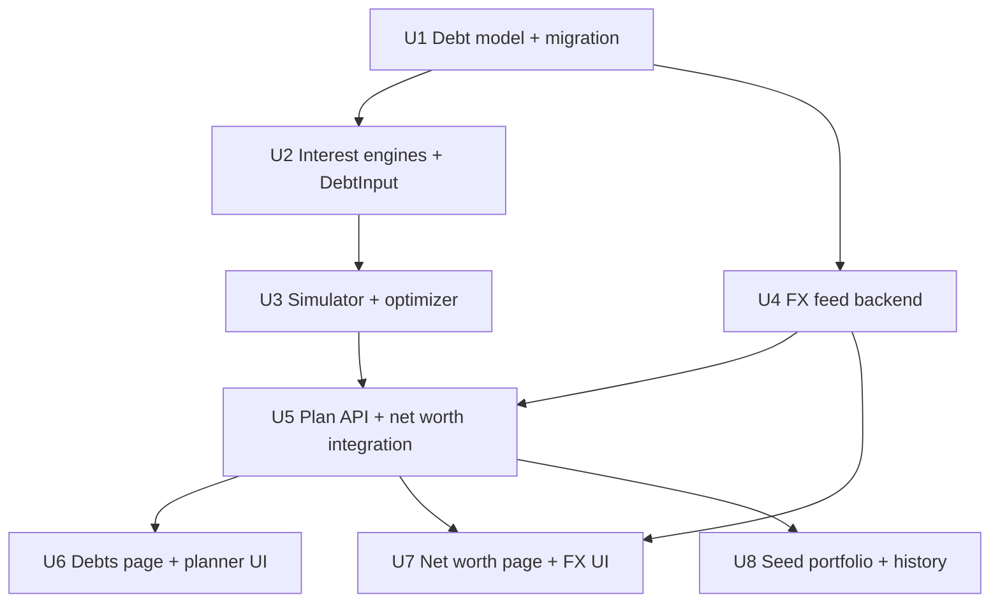

# feat: Debt mechanics, FX rate feeds, and payoff optimizer

## Summary

Extend the pure `services/analytics/` layer with per-type interest engines and a shortest-path payoff optimizer built on the existing month-stepped simulator; widen the `Debt` model with a repayment-type enum and an optional currency; store fetched provider rates (ExchangeRate-API open endpoint by default) in the existing per-user FX table with a source marker so manual rates always win; and rewrite the demo seed into a 4-debt, two-currency portfolio with 3 months of history.

---

## Problem Frame

The origin document covers the product motivation: four real debts spanning four repayment mechanics and multiple currencies, all modeled today as balance + APR + monthly compounding, which misstates what is owed and blinds the planner to mechanics that change the optimal strategy. This plan implements Phase 1 of that document (see Sources & References).

Plan-specific framing: the codebase is unusually well-positioned — a pure, ORM-free debt simulator (`backend/app/services/analytics/debt_plan.py`), an honest-conversion FX contract (`services/analytics/fx.py::convert` returning `None` → exclude + flag), and an established seed. The work is extension, not invention — but the mechanics change leaks into more surfaces than the debts API: three separate `DebtInput` construction sites, the surplus marginal-pound ranking, net worth's register-debt handling, and the digest.

---

## Requirements

Origin R-IDs (Phase 1 scope):

- R1. Every debt has a repayment type: amortized fixed-term, flat-interest-on-principal, revolving, or statement-only.
- R2. Interest accrual and payoff projection follow each type's real mechanics; promo-APR windows and minimum payments keep working where they apply.
- R3. Statement-only debts derive effective mechanics from installment + balance + end date; derived figures are labeled estimated.
- R4. Each debt carries its own currency.
- R5. A debt whose currency has no FX rate is shown but excluded from totals and flagged (accounts' honest-conversion rule).
- R6. Net worth presents one wealth picture: converted account balances and valuations minus converted debt balances, with true total owed and payoff dates.
- R7. FX rates can refresh automatically from an external source behind an explicit opt-in (off by default).
- R8. A manually-set rate always overrides a fetched rate.
- R9. Fetch failures degrade gracefully: last-known rates stay in use with visible staleness.
- R10. The optimizer computes the allocation minimizing time-to-debt-free / total interest, respecting mechanics and constraints (minimums, promo cliffs, flat-interest prepayment futility).
- R11. Output is a concrete plan: per-debt per-month payments, debt-free date, totals, savings vs minimums-only, avalanche, and snowball.
- R12. The plan is denominated in the display currency; per-debt figures also show the debt's own currency.
- R13. What-if extras (one-off and recurring) re-run the optimization and show the delta.
- R14. Output is framed as computed arithmetic with assumptions visible, never advice.
- R15. The demo seed includes a 4-debt portfolio (revolving card, amortized loan, flat-interest loan, statement-only loan) across ≥2 currencies with 3 months of payment history and balance snapshots; the minimums-sum-to-40%-of-salary invariant is preserved.

**Origin flows:** F1 (set up a real debt), F2 (find the shortest path), F3 (see it immediately)
**Origin acceptance examples:** AE1 (covers R5), AE2 (covers R8), AE3 (covers R9), AE4 (covers R2, R10), AE5 (covers R3), AE6 (covers R15). AE7–AE8 belong to Phases 2–3, out of this plan's scope.

---

## Scope Boundaries

- Phases 2–4 of the origin document (receivables, statement-anchored reconciliation, wealth trajectory) — sequenced for later plans.
- No dedicated Settings page — the FX opt-in and rate management stay on the Net worth page, where currency is already managed.
- No FX provider beyond the single seam (Frankfurter default; the seam exists so a swap is a follow-up, not a rewrite).
- No per-month schedule export (CSV/PDF) — on-screen rendering only.
- Live bank connections / Open Banking (origin-carried exclusion).
- No advice framing — comparisons and schedules only (origin-carried).

### Deferred to Follow-Up Work

- Receivables (origin Phase 2), statement reconciliation (origin Phase 3), trajectory projection (origin Phase 4): each gets its own plan.
- Flat-loan early-settlement rebate conventions (e.g. Rule of 78 partial rebates): v1 documents its assumption in plan output; refinement deferred until a real contract needs it.
- Self-hosting the Frankfurter container as a compose/k8s service for fully-offline FX: noted in ops; not part of this change.

---

## Context & Research

### Relevant Code and Patterns

- `backend/app/services/analytics/debt_plan.py` — `DebtInput` (+ `from_model`), `effective_apr`, `_resolved_minimum` (2%/£25 fallback + assumption strings), `simulate_payoff` (600-month cap, `TWO_DP`/`ROUND_HALF_UP` accrual, promo cliffs, unpayable bailout), `compare_strategies`. The optimizer and engines build on this, not beside it.
- Three `DebtInput` construction sites: `backend/app/api/v1/debts.py`, `backend/app/api/v1/insights.py::_debt_inputs`, `backend/app/services/digest.py::_debt_input` (hand-copied builder — silently drops new fields if forgotten).
- `backend/app/services/analytics/surplus.py::rank_allocations` imports `effective_apr` — the marginal-pound ranking must become mechanics-aware.
- `backend/app/services/analytics/fx.py::convert` — identity / `None` on missing rate / quantized product; `backend/app/services/analytics/net_worth.py` lines ~137–227 — register debts currently summed unconverted and held flat across the series.
- `backend/app/models/fx_rate.py` — `Numeric(18,8)` rate, unique `(user_id, currency)`; `backend/app/api/v1/fx.py` — router-local schemas, bulk upsert PUT.
- `backend/app/api/v1/auth.py::update_me` — display-currency change deletes all FX rows; generic setattr loop means new user fields flow through.
- `backend/pyproject.toml` — `httpx>=0.27.2` already a main dependency (unused in code); the FX fetcher needs no new dependency, but the entry becomes deliberate.
- Migration conventions from `backend/alembic/versions/0007`, `0010`, `0012`: plain `op.add_column`, `server_default` for NOT NULL additions, explicit PG enums with `checkfirst=True` + symmetric `downgrade()`, `NNNN_slug.py` naming (next: `0013`).
- `backend/app/seed.py` — column-aligned `DEBTS` table, invariant comment, idempotent `seed(db)`, `wipe_user`/`--reset`; `backend/app/seed_cashflow.py` — the multi-month seeding pattern to follow.
- `backend/tests/test_analytics.py` — pure-value engine tests, fixed `START = date(2026, 8, 1)`, `_card()` factory; `backend/tests/test_multi_currency.py` — `convert`/net-worth conversion cases; `backend/tests/conftest.py` — SAVEPOINT-per-test, `auth_client`.
- Frontend: `frontend/src/pages/Debts.tsx` (PlannerPanel queries `["debt-plan", extra]`, client-side strategy toggle over one response), `frontend/src/pages/NetWorth.tsx` (the currency/FX management surface; renders `register_debts` unconverted today), `frontend/src/api/types.ts` (all money as `string`), `frontend/src/lib/useCurrency.ts`.

### Institutional Learnings

- No `docs/solutions/` directory exists — nothing to carry.

### External References

- ExchangeRate-API open endpoint — default provider: no key, ~166 currencies including CLP (live-verified during review): https://www.exchangerate-api.com/docs/free (`https://open.er-api.com/v6/latest/{base}`).
- Frankfurter — self-hostable alternate behind the same seam; live-checked at ~30 ECB currencies, **no CLP**, which is why it is not the default: https://frankfurter.dev/ (Docker image available).

---

## Key Technical Decisions

- **Repayment type is a Postgres enum with `server_default="revolving"`**: existing rows migrate to the type whose math matches today's engine exactly — zero behavior change until a user edits a debt. Follows the 0012 enum-create pattern.
- **Debt currency is nullable; NULL means display currency**: preserves the register convention for untouched debts, makes conversion strictly opt-in per debt, and avoids a backfill guess. CLAUDE.md's "register figures carry no currency" note is updated to carve out debts.
- **Fetched rates reuse the `FxRate` table with a `source` column (`manual`/`auto`)**: one storage, one conversion path; "manual wins" (R8) becomes "auto refresh never upserts rows whose source is manual". The display-currency-change delete keeps working unchanged (fetched rows are deleted too; next enabled read refetches).
- **ExchangeRate-API open endpoint behind a provider seam in a new `services/fx_feed.py`**: the default provider is `https://open.er-api.com/v6/latest/{base}` — no key, ~166 currencies **including CLP** (live-verified; Frankfurter was live-checked at only ~30 ECB currencies with no CLP, so it demotes to the self-hostable alternative behind the same seam). Fetch is on-demand — triggered by rate reads when auto-refresh is enabled and rates are stale (>24h), plus an explicit refresh endpoint — so no scheduler/daemon is introduced. Provider base URL comes from `Settings` with a sensible default. Robustness contract: ~3s client timeout, a 15-minute per-user cooldown after a failed fetch (a provider outage must not become a per-page-load latency tax), ON CONFLICT upserts (two concurrent first-loads must not trip the unique constraint), and every fetched value passes the same validation manual entry gets before storage.
- **Optimizer = best over a candidate class, never worse than any displayed strategy**: candidates are all payoff priority orderings for ≤6 debts (720 simulator runs, kept fast by incumbent-bound pruning — abandon an ordering the moment its running months/interest exceeds the best found so far; review benchmarking showed naive enumeration at 7 debts × 600 months costs ~10–25s, far over budget) **plus, always, the minimum/snowball/avalanche runs already computed for the comparison set** — dynamic avalanche retargets monthly by current effective rate and can beat every static ordering on promo-cliff portfolios, so unioning the strategy runs makes "optimal ≤ every displayed strategy" true by construction. Above 6 debts, greedy-by-current-marginal-rate with promo-cliff lookahead, still unioned with the three strategy runs. Objective: minimize total interest; months-to-debt-free breaks ties. The marginal-rate function is the mechanics-aware replacement for `effective_apr`: revolving/amortized → current rate; flat → zero (prepayment saves no interest); statement-only → inferred rate.
- **Flat-loan v1 semantics**: interest each month is fixed on the original principal; extra allocation to flat loans is withheld by the optimizer and the reason surfaces in the plan's assumptions (AE4). Early-settlement rebate variants deferred (see Scope Boundaries).
- **Statement-only inference by solving the annuity equation** for the constant monthly rate matching installment/balance/remaining term (bisection); the debt then optimizes like an amortized loan at the inferred rate, with every figure labeled estimated (R3).
- **Plan output stays single-response**: `POST /debts/plan` returns minimum/snowball/avalanche/optimal in one payload (the UI's client-side strategy toggle pattern is preserved), now including a per-debt monthly schedule (R11) and echoing each debt's currency (R12).
- **Seed via direct inserts** following `seed_cashflow.py`'s multi-month pattern — the import pipeline stays out of seeding (origin deferred question, resolved: direct inserts; integrity surfaces are exercised by imports the user performs, not the seed).
- **Test-first for engines and optimizer**: pure-value tests in the `test_analytics.py` style, fixed dates, exact quantized Decimals plus property assertions (optimal ≤ avalanche ≤ … on total interest).

---

## Open Questions

### Resolved During Planning

- FX provider: ExchangeRate-API open endpoint as default (CLP coverage live-verified during review; Frankfurter live-checked at 30 ECB currencies without CLP and demoted to the self-host alternate behind the same seam).
- Optimizer algorithm: pruned ordering search ≤6 debts unioned with the three comparison-strategy runs (never worse than a displayed strategy by construction), greedy beyond; total interest primary, months tie-break (see Key Technical Decisions).
- Statement-only inference: bisection on the annuity equation.
- Seed strategy: direct inserts, not the import pipeline.
- Fetched-rate storage: same `FxRate` table + `source` marker (not a second table).

### Deferred to Implementation

- Bisection tolerance and guard rails for degenerate statement-only inputs (installment below pure-interest level): surface as an `unpayable`-style assumption rather than crash; exact thresholds tuned against tests.
- Frankfurter response handling details (base-currency pivoting to the user's display currency, unsupported-currency behavior): shaped by the live API contract at implementation time.
- Exact form layout for per-type debt fields on `Debts.tsx` (which fields show/hide per type) — visual arrangement is an implementation call; the field *set* per type is fixed by U1's schema validation.
- Whether the per-month schedule table virtualizes or paginates for long horizons — depends on real rendered size.

---

## High-Level Technical Design

> *This illustrates the intended approach and is directional guidance for review, not implementation specification. The implementing agent should treat it as context, not code to reproduce.*

Repayment-type behavior matrix (the core of R1/R2/R10):

| Type | Monthly interest | Expected payment | Marginal value of prepayment | Notes |
|---|---|---|---|---|
| `revolving` | rate × current balance | minimum (2%/floor fallback) + any extra | current effective rate | today's semantics, unchanged; promo windows apply |
| `amortized` | rate × current balance | fixed installment to `ends_on` | current effective rate | installment known; payoff date contractual unless prepaid |
| `flat` | rate × **original principal** | fixed installment to `ends_on` | **zero** | installments never shrink; optimizer withholds extras and says why |
| `statement_only` | inferred rate × current balance | known installment | inferred rate (estimated) | rate solved from installment/balance/term; all outputs labeled estimated |

Optimizer shape: enumerate payoff priority orderings of the optimizable debts (flat loans excluded from extra allocation) with incumbent-bound pruning, union the candidate set with the minimum/snowball/avalanche runs already computed for the comparison, and select the candidate minimizing total interest (months-to-debt-free as tie-break); emit the winning run's per-debt monthly schedule plus the standard comparison set. When the only open debts are flat loans, unallocated extra is reported as "uncommitted surplus" per month (and the cascade loop terminates) rather than looping or vanishing.

---

## Implementation Units

Dependency graph:

### U1. Debt model: repayment type, currency, installment

**Goal:** Debts can state their repayment type, currency, and installment amount; existing data migrates with zero behavior change.

**Requirements:** R1, R4

**Dependencies:** None

**Files:**
- Modify: `backend/app/models/debt.py`, `backend/app/schemas/debt.py`, `backend/app/api/v1/debts.py`
- Create: `backend/alembic/versions/0013_debt_mechanics_currency.py`
- Test: `backend/tests/test_debts_api.py` (create or extend the existing debts API test file)

**Approach:**
- New columns: repayment type (PG enum: revolving / amortized / flat / statement_only, `server_default="revolving"`), currency (`String(3)`, nullable — NULL = display currency), installment amount (`Numeric(14,2)`, nullable).
- Schema-level conditional validation: amortized/flat/statement_only require installment + `ends_on`; flat additionally requires `original_principal > 0` (its interest is computed on it — the schema's `Decimal("0")` default would silently produce zero interest); statement_only additionally requires current balance; revolving keeps today's shape. Currency validated `^[A-Za-z]{3}$` uppercased (mirror the FX router's validator).
- Precedence rule stated once here, honored everywhere downstream: for the three fixed-installment types, `installment` supersedes `minimum_payment` in the simulator budget, surplus ranking, digest lines, and the seed invariant (`minimum_payment` remains meaningful only for revolving).
- `DebtOut` exposes the new fields; `DebtUpdate` stays all-optional with `exclude_unset`.

**Patterns to follow:**
- Enum migration: `backend/alembic/versions/0012_household.py` (checkfirst create + downgrade drop); nullable String(3) currency: `0010_multi_currency.py`.

**Test scenarios:**
- Happy path: create one debt of each type with its required fields → 201, fields echoed.
- Error path: amortized without installment or `ends_on` → 422; flat with zero/absent `original_principal` → 422; bad currency code → 422.
- Edge case: PATCH switching revolving → amortized enforces the newly-required fields.
- Integration: existing seeded debt (pre-migration shape) lists as revolving with NULL currency.

**Verification:**
- Migration applies and downgrades cleanly on a populated DB; all existing debts read back unchanged as revolving.

---

### U2. Mechanics-aware engines and DebtInput

**Goal:** The analytics layer computes accrual, expected payments, marginal prepayment value, and statement-only inference per repayment type; every `DebtInput` construction site carries the new fields.

**Requirements:** R2, R3

**Dependencies:** U1

**Files:**
- Modify: `backend/app/services/analytics/debt_plan.py`, `backend/app/api/v1/insights.py`, `backend/app/services/digest.py`, `backend/app/services/analytics/surplus.py`
- Test: `backend/tests/test_analytics.py`

**Execution note:** Implement the new engine behavior test-first — pure-value tests with fixed dates, exact quantized Decimals.

**Approach:**
- `DebtInput` gains repayment type, installment, original principal, `ends_on`, currency; `from_model` updated; `digest.py`'s hand-copied builder and `insights.py::_debt_inputs` updated in the same commit (the known silent-drop trap).
- New per-type functions for monthly interest and expected payment per the behavior matrix; statement-only inference solves the annuity equation by bisection, returns rate + an "estimated" assumption string; degenerate inputs (installment ≤ pure interest) yield an explicit assumption, not an exception.
- Real inputs won't satisfy balance = annuity(installment, rate, term): fixed-installment types keep charging the installment past `ends_on` until the balance clears, emitting an assumption ("entered terms imply payoff N months after the stated end date"); for flat, interest accrual stops at `ends_on` so a residual balance can't spiral toward MAX_MONTHS.
- `effective_apr` remains for promo-window resolution; a new mechanics-aware marginal-rate function replaces it in `surplus.py::rank_allocations` (flat → zero marginal return).
- Currency-honesty at the leaked consumers: surplus allocation figures and digest debt lines convert foreign-currency debt amounts at current rates (exclude-and-flag when no rate) instead of mixing native magnitudes into display-currency text; the forecast due-day filter in `insights.py` additionally requires debt currency ∈ {NULL, display} so a foreign-currency unlinked debt's minimum stops rendering as a display-currency due marker.

**Patterns to follow:**
- `_resolved_minimum`'s `(value, assumption-string)` shape for anything estimated or defaulted.

**Test scenarios:**
- Happy path (amortized): known rate/installment/term → schedule reaches zero at `ends_on` ± 1 month; interest portion declines monotonically.
- Happy path (flat): interest per month constant at original-principal × rate/12 regardless of balance.
- Covers AE5. Statement-only: installment/balance/term with a known constructed rate → inference recovers it within tolerance; output labeled estimated.
- Edge case: statement-only with installment below monthly pure interest → assumption surfaced, no crash.
- Edge case: amortized with balance too high for installment × remaining term → payoff extends past `ends_on` with the assumption string; balance-clears-early counterpart also covered.
- Happy path: digest/surplus figures for a CLP debt convert at the saved rate; with no rate the debt is excluded and flagged, never mixed.
- Edge case: promo window on a revolving debt still zeroes accrual inside the window (existing test keeps passing).
- Happy path: surplus ranking puts a flat loan below a lower-APR revolving debt (marginal return zero).

**Verification:**
- All existing `test_analytics.py` debt tests pass unchanged (revolving default preserves current math); new per-type tests green.

---

### U3. Simulator mechanics + payoff optimizer

**Goal:** `simulate_payoff` honors per-type payment/accrual mechanics; a new optimizer finds the allocation minimizing time-to-debt-free and total interest and emits a per-debt monthly schedule.

**Requirements:** R10, R11, R13, R14

**Dependencies:** U2

**Files:**
- Modify: `backend/app/services/analytics/debt_plan.py`
- Create: `backend/app/services/analytics/debt_optimizer.py`
- Test: `backend/tests/test_analytics.py`

**Execution note:** Test-first; property assertions are the backbone (optimal never worse than avalanche/snowball/minimum on total interest for the same budget).

**Approach:**
- Simulator: fixed-installment types pay their installment (not the 2% fallback); flat accrues on original principal; extra-cascade skips flat loans; promo cliffs and the unpayable bailout retained; per-month per-debt payment amounts recorded so the winning run can report a schedule.
- Optimizer: enumerate priority orderings of optimizable debts (≤6 → exhaustive with incumbent-bound pruning; >6 → greedy by marginal rate with promo-cliff lookahead), one simulator run each, **always unioned with the minimum/snowball/avalanche comparison runs**, minimizing total interest with months as tie-break; return the winner as a strategy result alongside the three baselines. When only flat loans remain open, unallocated extra reports as per-month "uncommitted surplus" and the cascade terminates.
- Snowflakes (one-off extras) and `extra_monthly` (recurring) both flow into the optimizer run (R13).
- Assumption strings carry the "why" for withheld flat-loan extras and any estimated rates (R14).

**Patterns to follow:**
- `compare_strategies`' dict-of-PlanResult shape; `MAX_MONTHS`/unpayable conventions; `start` parameter for clock-free tests.

**Test scenarios:**
- Covers AE4. Flat loan + revolving card, spare capacity → extras go to the card; assumptions explain the flat withholding.
- Happy path: optimal ≤ avalanche ≤ minimum on total interest across a 4-debt mixed portfolio.
- Happy path: promo-cliff portfolio where greedy-by-rate is suboptimal → exact search finds the ordering that clears the promo debt before its cliff.
- Happy path: per-debt monthly schedule sums to the monthly budget each month, including months after the last non-flat debt clears (remainder shows as uncommitted surplus).
- Regression (review counterexample): £20,000 @30% (min £400) + £12,000 promo-0% reverting 32% (min £250), £350 extra — optimal total interest ≤ dynamic avalanche's (the candidate-set union guarantees it).
- Edge case: all-flat portfolio → optimizer degenerates to minimums-only, plan says why.
- Edge case: snowflake in month 3 shortens the optimal horizon vs the same plan without it.
- Error path: unpayable portfolio → `unpayable=True`, no savings comparison (existing convention).

**Verification:**
- Optimizer runtime is measured, not assumed: with pruning, a 6-debt × 600-month portfolio completes within ~1s in the containerized test environment (a benchmark assertion, tuned against the actual number during implementation).

---

### U4. FX feed backend: provider seam, source column, opt-in

**Goal:** Users can opt in to automatic rate refresh from Frankfurter; manual rates always win; staleness is visible; failures degrade to last-known rates.

**Requirements:** R7, R8, R9

**Dependencies:** U1 (migration sequence only — takes `0014`)

**Files:**
- Create: `backend/app/services/fx_feed.py`, `backend/alembic/versions/0014_fx_source_auto_refresh.py`
- Modify: `backend/app/models/fx_rate.py`, `backend/app/models/user.py`, `backend/app/schemas/auth.py`, `backend/app/api/v1/fx.py`, `backend/app/api/v1/auth.py`, `backend/app/core/config.py`, `docker-compose.yml`, `CLAUDE.md`
- Test: `backend/tests/test_fx_feed.py` (create; mock the HTTP boundary — no network in tests)

**Approach:**
- `FxRate.source` (`manual`/`auto`, `server_default="manual"`); `User` gains an auto-refresh boolean (default false) settable via the existing `PATCH /auth/me` setattr flow.
- `fx_feed.py`: a provider seam (fetch-latest-rates for a set of currencies against a base) with the ExchangeRate-API open-endpoint implementation on `httpx` (already a dependency) as the default — CLP coverage verified — and Frankfurter documented as the self-hostable alternate behind the same seam; base URL in `Settings` with a default, passed through the compose `environment:` block per repo convention. The client uses a ~3s timeout; every parsed entry passes the same validation `FxRateIn` applies to manual input (currency pattern, positive bounded rate, quantize) before upsert — an entry failing validation is a per-currency fetch failure under R9, never persisted, never raised.
- Refresh triggers: `GET /fx` and the net-worth load refresh opportunistically when enabled and rates are stale (>24h); an explicit refresh endpoint under `/fx` forces it. Refresh upserts only non-manual rows (ON CONFLICT, so concurrent first-loads can't trip the unique constraint) and never touches currencies the user has set manually (R8); fetch errors leave rows untouched (R9) and start a 15-minute per-user cooldown so an outage never becomes a per-request latency tax — staleness shows through the existing `as_of` field plus `source` in responses.
- `PUT /fx` (manual entry) marks rows manual; display-currency change keeps deleting all rows (fetched ones refetch on next enabled read).
- CLAUDE.md's "no external FX API" and the FxRate docstring are updated to describe the opt-in feed.

**Patterns to follow:**
- Router-local schemas in `fx.py`; `Settings` + compose passthrough convention documented in CLAUDE.md's Configuration section.

**Test scenarios:**
- Covers AE2. Manual GBP rate + fetched GBP rate available → conversion uses the manual value; refresh does not overwrite it.
- Covers AE3. Enabled + stale + provider erroring (mocked) → rates unchanged, response still serves last-known values with their `as_of`.
- Happy path: enabled + stale → mocked provider payload upserts auto rows for exactly the currencies in use (accounts + debts), `as_of` today.
- Edge case: disabled (default) → no fetch attempted on reads (mock asserts zero calls).
- Edge case: provider missing a requested currency → that currency simply stays unconverted (honest-conversion path).
- Error path: provider returns 200 with a malformed/out-of-range rate → entry rejected by validation, existing row untouched, treated as per-currency failure.
- Edge case: a second read within the failure cooldown makes no outbound call (mock asserts).
- Integration: display-currency change deletes all rows; next enabled read refetches auto rows against the new base.

**Verification:**
- With the feature disabled the backend makes no outbound calls anywhere (test-asserted), preserving current behavior exactly.

---

### U5. Plan API + net worth integration

**Goal:** `POST /debts/plan` returns the optimal strategy with a per-debt monthly schedule alongside existing comparisons; net worth converts per-currency debts under the honest-conversion rule.

**Requirements:** R5, R6, R11, R12

**Dependencies:** U3, U4

**Files:**
- Modify: `backend/app/api/v1/debts.py`, `backend/app/schemas/debt.py`, `backend/app/services/analytics/net_worth.py`, `backend/app/api/v1/insights.py`
- Test: `backend/tests/test_insights_api.py`, `backend/tests/test_multi_currency.py`, `backend/tests/test_debts_api.py`

**Approach:**
- `PlanCompareOut` gains an `optimal` member (same `PlanOut` shape) plus the schedule structure; savings fields keep the `None`-when-unpayable convention; each plan debt echoes its currency (R12 — conversion of foreign-currency debt cash flows into the display-currency budget uses current rates, stated in assumptions). Debts whose currency has no rate are **excluded from the optimization pool**, still listed in the response with an "unconverted — excluded from plan" assumption and an `excluded_currencies` field mirroring net worth — the plan endpoint gets the same honest-conversion contract R5 gives net worth.
- `GET /debts/summary` stops summing raw balances in SQL: totals convert per-currency with exclude-and-flag for missing rates, so a CLP debt can never read as £5M in the Debts header.
- `net_worth.py`: the register-debt tuple contract gains currency **and a payoff date** (sourced from the same simulator mechanics, so R6's "per-debt payoff dates" is actually delivered by the wealth view, not only the planner); unlinked debts convert via `fx.convert` — missing rate → excluded from totals, currency added to `excluded_currencies`, debt still listed (R5); the flat-across-series treatment stays.
- `insights.py::networth` passes debt currencies and includes debt currencies in the FX-feed refresh set (U4).

**Patterns to follow:**
- `_plan_out`'s dataclass→Pydantic conversion; `has_rate` gating in `net_worth.py`.

**Test scenarios:**
- Covers AE1. Debt in CLP with no CLP rate → response lists the debt, total excludes it, `excluded_currencies` includes CLP.
- Happy path: CLP debt with a rate → converted at the rate into liabilities, totals shift accordingly.
- Happy path: plan response contains optimal strategy + schedule; optimal total interest ≤ avalanche's.
- Edge case: NULL-currency debt behaves exactly as today (display-denominated, no conversion).
- Integration: full `POST /debts/plan` through the API with a mixed 4-type portfolio → 200, schemas validate, assumptions include estimated/withheld notes.
- Edge case: plan request including a no-rate CLP debt → debt excluded from the pool, listed with the "unconverted — excluded from plan" assumption, `excluded_currencies` populated.
- Happy path: `GET /debts/summary` with a rated CLP debt converts it; with no rate it is excluded and flagged, never summed raw.

**Verification:**
- `test_multi_currency.py` existing cases pass unchanged; new debt-conversion cases green.

---

### U6. Frontend: Debts page + planner UI

**Goal:** Type-aware debt forms with currency, and a planner that surfaces the optimal plan, its schedule, and one-off extras.

**Requirements:** R1, R11, R12, R13, R14 (UI surface)

**Dependencies:** U5

**Files:**
- Modify: `frontend/src/pages/Debts.tsx`, `frontend/src/api/types.ts`

**Approach:**
- Create/edit forms show per-type fields (validation mirrors U1's rules; the minimum-payment field hides for fixed-installment types per U1's precedence rule); type badge and per-debt currency on cards; amounts for a debt with its own currency format in that currency (`fmtMoney(value, debtCurrency)`).
- Currency selector defaults to an explicit "Same as display currency" option that submits NULL (mirroring Net Worth's "Automatic" pattern) — edit forms pre-select a specific currency only when the debt already has one saved, preserving the backend's NULL-vs-explicit distinction.
- Planner: "Optimal" joins the strategy toggle (still client-side over one response); the per-debt monthly schedule table renders **only under the Optimal tab** (it's the only strategy carrying schedule data — avalanche/snowball fall back to the existing per-debt summary table); each schedule row renders in that debt's own currency with a currency label (the Net worth accounts-table pattern), only the aggregate budget row in display currency.
- One-off extras are a managed list of month + amount pairs with add/remove affordances, visibly listed next to the schedule so the user can see what drives the delta; assumptions footnotes render estimated/withheld notes verbatim.
- Money stays strings in payloads; `toNum` only at render/chart time.

**Patterns to follow:**
- Existing `PlannerPanel` query/toggle structure; mutation invalidations of `["debt-summary"]` + `["debt-plan"]`.

**Test scenarios:**
- Test expectation: none — the repo has no frontend test harness; verification is lint + `tsc -b` + build (repo convention) plus the manual walkthrough below.

**Verification:**
- `npm run lint` (zero warnings) and `npm run build` pass; manually: create each debt type, run the planner, see optimal beat avalanche on the seeded portfolio, add a one-off extra and watch the delta.

---

### U7. Frontend: Net worth + FX controls

**Goal:** Net worth shows converted debts honestly; the FX card gains the auto-refresh toggle, source badges, and staleness.

**Requirements:** R5, R6, R7, R9 (UI surface)

**Dependencies:** U4, U5

**Files:**
- Modify: `frontend/src/pages/NetWorth.tsx`, `frontend/src/api/types.ts`

**Approach:**
- Register-debt rows render in the debt's currency with converted display value and payoff date (via U5), or an "excluded — no rate" flag matching the accounts treatment; `excluded_currencies` banner already exists and picks up debt currencies via U5.
- FX card: auto-refresh toggle (PATCH `/auth/me`), per-rate source badge (manual/auto) and `as_of` staleness, a refresh-now action with real feedback states — button disabled with a spinner while in flight, and on failure an inline "Refresh failed — showing last-known rates from ⟨as_of⟩" instead of silent success-lookalike — and updated copy replacing "Rates are manual — no external API".

**Patterns to follow:**
- The existing display-currency mutation's invalidate-then-refresh ordering (comment in `NetWorth.tsx` explains why).

**Test scenarios:**
- Test expectation: none — no frontend test harness; lint/build + manual walkthrough.

**Verification:**
- Toggle on → rates appear with auto badges after a refresh; setting a manual rate for the same currency shows manual winning; toggle off → no fetches (network tab quiet).

---

### U8. Seed: 4-debt portfolio with 3 months of history

**Goal:** A fresh seed demonstrates every Phase-1 surface: mixed-mechanics multi-currency debts, 3 months of payments and balance snapshots, and an optimizer with something real to say.

**Requirements:** R15

**Dependencies:** U5

**Files:**
- Modify: `backend/app/seed.py`, `CLAUDE.md`
- Test: extend the seed smoke expectations if a seed test exists; otherwise verified by `make seed-reset` output

**Approach:**
- Reshape `DEBTS` to four entries — revolving card (GBP), amortized personal loan (GBP), flat-interest loan (CLP), statement-only loan (GBP) — with terms chosen so converted minimums still sum to exactly 40% of the $5,000 salary (the invariant check at the end of `seed()` keeps printing it; the CLP minimum counts at the seeded CLP→GBP rate).
- Generate 3 months of history following `seed_cashflow.py`'s pattern: salary, expenses, and per-debt payment transactions each month; a `BalanceSnapshot` per account per month-end; debt balances rolled back consistently so current balances reconcile with the payment history.
- Update the obsolete comment about debt accounts being forced GBP; update CLAUDE.md's seed note (portfolio shape changed, invariant preserved).

**Patterns to follow:**
- Column-aligned constant tables with the invariant proof comment; idempotent `seed(db)` + `wipe_user`.

**Test scenarios:**
- Happy path: `make seed-reset` → invariant line prints 40%; demo login shows 4 debts with type badges, Net worth shows the CLP debt converted, planner's optimal strategy withholds extras from the flat loan.
- Covers AE6. Fresh seed → Dashboard, Net worth, Debts, and the planner all render populated with 3 months of history and snapshots.

**Verification:**
- `make seed-reset` completes idempotently twice in a row; the demo portfolio exercises all four mechanics and both currencies.

---

## System-Wide Impact

- **Interaction graph:** `DebtInput` feeds four consumers — debts plan API, insights (surplus + forecast due-markers), digest, and now the optimizer. The digest's hand-copied builder is the known break point; U2 updates all sites in one commit.
- **Error propagation:** FX fetch failures must never fail a read path — refresh is best-effort, conversion falls back to last-known rates, and missing rates flow through the established `convert → None → exclude + flag` contract.
- **State lifecycle risks:** the display-currency-change rate purge now also deletes fetched rows — intended (rates are denominated against the old base), and self-healing on the next enabled read. Migration `0013` touches every debt row via server default; prestart's pre-upgrade archive covers rollback.
- **API surface parity:** `GET /fx` responses gain `source`; `DebtOut` gains three fields; `PlanCompareOut` gains `optimal` + schedule + `excluded_currencies`; `GET /debts/summary` becomes conversion-aware. All additive — existing clients (the SPA) are the only consumers.
- **Integration coverage:** the mixed-portfolio `POST /debts/plan` API test (U5) and the seed walkthrough (U8) are the cross-layer proofs unit tests can't give.
- **Unchanged invariants:** forecast/digest/surplus remain single-currency by design (`load_forecast_scope` untouched); budgets/goals stay display-denominated; the import pipeline, household, and integrity surfaces are untouched.

---

## Risk Analysis & Mitigation

| Risk | Likelihood | Impact | Mitigation |
|------|-----------|--------|------------|
| Mechanics change silently alters existing users' plan numbers | Low | High | `revolving` default reproduces current math exactly; existing analytics tests must pass unchanged (U2/U3 verification) |
| Digest builder drops new DebtInput fields | Med | Med | Updated in the same commit as `DebtInput` (U2); test asserts digest debt lines reflect type-aware minimums |
| Flat-loan model mismatches a real contract (rebate on settlement) | Med | Med | v1 semantics stated in plan assumptions; rebate variants explicitly deferred; statement-only type is the honest fallback |
| Optimizer blowup beyond 7 debts | Low | Low | Hard cutover to greedy; both paths share the simulator so results stay comparable |
| Provider outage or missing currency | Med | Low | Best-effort refresh with timeout + failure cooldown, last-known rates + staleness, manual entry always available; honest-conversion excludes rather than guesses; default provider chosen for CLP coverage |
| Multi-currency budget arithmetic confuses (paying a CLP debt from a GBP budget) | Med | Med | Conversion assumption stated in plan output (R14); per-debt figures shown in native currency (R12) |
| Seed invariant breaks with multi-currency minimums | Low | Low | Invariant computed on converted values at the seeded rate; the printed check remains the guard |

---

## Documentation / Operational Notes

- CLAUDE.md updates ride in U4 (FX convention), U5/U1 (debt currency carve-out), U8 (seed shape) — each in the unit that changes the behavior it documents.
- New `Settings` key for the FX provider base URL must be passed through `docker-compose.yml`'s backend `environment:` block (repo convention); the k8s manifests need no change (the default URL suffices; a self-hosted Frankfurter later would add an env + optional service).
- The k8s "prod" instance picks the feature up on the next `skaffold run`; migrations `0013`/`0014` run via prestart with its automatic pre-upgrade archive.
- After `pyproject.toml` is untouched (httpx already present), no `make fresh` is required — plain `make up` suffices for backend changes; frontend needs no new deps either.

---

## Sources & References

- **Origin document:** [docs/brainstorms/2026-08-07-wealth-debt-payoff-requirements.md](../brainstorms/2026-08-07-wealth-debt-payoff-requirements.md)
- Related code: `backend/app/services/analytics/debt_plan.py`, `backend/app/services/analytics/net_worth.py`, `backend/app/services/analytics/fx.py`, `backend/app/api/v1/debts.py`, `backend/app/api/v1/fx.py`, `backend/app/seed.py`
- External docs: [Frankfurter](https://frankfurter.dev/), [ExchangeRate-API open endpoint](https://www.exchangerate-api.com/docs/free)
